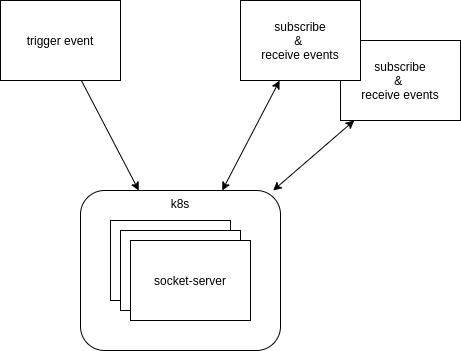

# k8s-web-socket-test

- [k8s-web-socket-test](#k8s-web-socket-test)
  - [Description](#description)
  - [TO-DOs](#to-dos)
  - [Start the Application for Development](#start-the-application-for-development)
  - [Start the Application in K8s](#start-the-application-in-k8s)
    - [Deploy the Application to K8s](#deploy-the-application-to-k8s)
    - [Open the Application](#open-the-application)
    - [Setup a K8s Cluster](#setup-a-k8s-cluster)
    - [Setup Insecure Registries](#setup-insecure-registries)

## Description

The idea is to have a couple to socket-server pods running in K8s and connect via web socket connections from a Angular application.

If a pod will be terminated, the socket connection should be switched to another pod.

Diagram:



## TO-DOs

* Socket connection is not switching to another pod.

## Start the Application for Development

* Go to `socket-server/`and execute `npm start`
* Go to `subscriber/` and execute `npm start`

## Start the Application in K8s

### Deploy the Application to K8s

Open a terminal and execute `watch -n1 kubectl -n dev get pods`.

Open another terminal and:
* go to `socket-server/` and execute `make deploy`,
* go to `subscriber/` and execute `make deploy`.

Notice the other build targets you can use (`make ` &lt;tab&gt;&lt;tab&gt;):

```sh
x1@x1:~/development/k8s-web-socket-test/socket-server$ make
build-application    clear-node_modules   dist                 k8s-kustomize
clear-all            deploy               docker-build         node_modules
clear-dist           deploy-with-build    k8s-apply            rebuild-application
```

### Open the Application

Execute `kubectl -n dev get ingresses` to see your Ingresses:

```sh
NAME                    CLASS    HOSTS
ingress-socket-server   <none>   socket-server.127.0.0.1.nip.io
ingress-subscriber      <none>   subscriber.127.0.0.1.nip.io
```

Open: <http://subscriber.127.0.0.1.nip.io>

### Setup a K8s Cluster

Your can try to set up a [kind](https://kind.sigs.k8s.io/docs/user/quick-start/) cluster using the following script.

Go to `tools/` and try to execute `./install-cluster.sh`.

### Setup Insecure Registries

If you try to work with a insecure registry, you will get `http: server gave HTTP response to HTTPS client`.

Fix:

Create or modify `/etc/docker/daemon.json`

```json
{ "insecure-registries":["localhost:5000"] }
```

Restart docker daemon

```bash
sudo service docker restart
```
